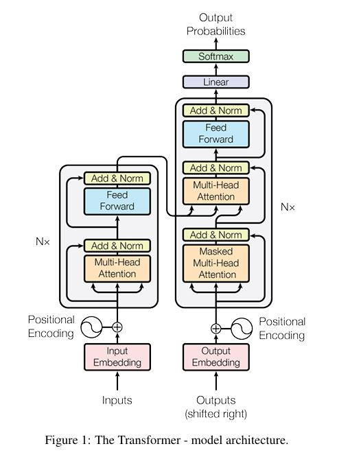
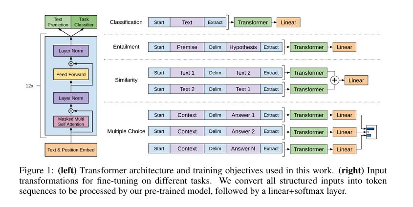
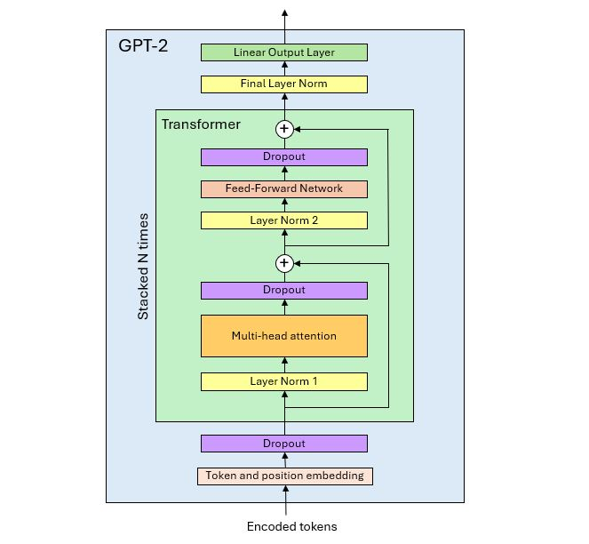

# GPT-2 Model in Tensorflow

## 1. Introduction

This repo contains a Tensorflow implementation of OpenAI's GPT-2 model.

The main goal of this project was to construct the model using **ONLY** these three research papers:

- The original transformer paper published in 2017:
    Ashish Vaswani, Noam Shazeer, Niki Parmar, Jakob Uszkoreit, 
    Llion Jones, Aidan N. Gomez, Lukasz Kaiser, Illia Polosukhin.
    "Attention Is All You Need".
    https://arxiv.org/abs/1706.03762

- The GPT paper published by OpenAI in 2018:
    Alec Radford, Karthik Narasimhan, Tim Salimans, Ilya Sutskever.
    "Improving Language Understanding by Generative Pre-Training"
    https://cdn.openai.com/research-covers/language-unsupervised/language_understanding_paper.pdf

- The GPT-2 paper published by OpenAI in 2019:
    Alec Radford, Jeffrey Wu, Rewon Child, David Luan, Dario Amodei, Ilya Sutskever.
    Language Models are Unsupervised Multitask Learners".
     https://cdn.openai.com/better-language-models/language_models_are_unsupervised_multitask_learners.pdf?utm_source=chatgpt.com


## 2. GPT-2 model architecture

### Methodology

In the section entitled 'Model Specifications' of the GPT Paper, the authors state:

    "Our model largely follows the original transformer work. We trained a 12-layer decoder-only transformer with masked self-attention heads (768 dimensional states and 12 attention heads).

And in section '2.3 Model' of the GPT-2 Paper:

    "We use a Transformer (Vaswani et al., 2017) based architecture for our LMs. The model largely follows the details of the OpenAI GPT model (Radford et al., 2018) with a few modifications."

Therefore, I used the following method to look for information:

- If present in the GPT-2 Paper, use it.
- If missing in the GPT-2 Paper but present in the GPT Paper, use it.
- If missing in the GPT and GPT-2 Papers, look for it in the Transformer Paper.

### Original transformer architecture

The diagram of the model architecture from the original Transformer Paper (Figure 1) is reproduced below.



The model comprises an encoder and a decoder that are built with stacks of multi-head self-attention blocks.

The diagrams of the attention head and multi-head attention block (Figure 2) are shown below.


In the paper, the term 'layer' refers to a transformer block instance. The model 'hidden size' refers to the size of the embeddings.

I used the same terminology for my implementation.

### GPT decoder-only architecture

The GPT model architecture diagram from the GPT Paper (Figure 1) is reproduced below:



In the original transformer-decoder architecture, the layer is built with 3 sub-layers:
- Masked multi-head attention + layer norm
- Encoder-decoder cross-attention + layer norm
- Feed-forward network + layer norm

Because it is a decoder-only architecture, the GPT model requires only 2 sub-layers:
- Masked multi-head self-attention + layer norm
- Feed-forward network + layer norm

### Layer normalization

In section '2.3 Model' of the GPT-2 Paper:

    "Layer normalization (Ba et al., 2016) was moved to the input of each sub-block, similar to 
    a pre-activation residual network (He et al., 2016) and an additional layer normalization 
    was added after the final self-attention block."

### Dropout layers

In Section '5.4 Regularization' of the Transformer Paper:

    "We apply dropout to the output of each sub-layer, before it is added to the sub-layer input and
    normalized. In addition, we apply dropout to the sums of the embeddings and the positional encodings
    in both the encoder and decoder stacks. For the base model, we use a rate of P_drop=0.1."

Since dropout layers are not mentioned in the GPT or GPT-2 papers, we assume they follow the same configuration as in the Transformer Paper.

### GPT-2 architecture diagram

Using the information above, it is now possible to complete the diagram of the GPT architecture and draw the architecture of the GPT-2 model.




## 3. GPT-2 model sizes

### Vocabulary size and context length

The vocabulary size and context length are given in section '2.3 Model' of the GPT-2 Paper:

    "The vocabulary is expanded to 50,257. We also increase the context size from 512 to 1024 tokens
    and a larger batch size of 512 is used."


### GPT-2 model sizes

GPT-2 model sizes are provided in the GPT-2 Paper (Table 1):

| Parameters | n_layers |  d_model  |
|------------|----------|-----------|
| 117M       |   12     |      768  |
| 345M       |   24     |     1024  |
| 762M       |   36     |     1280  |
| 1542M      |   48     |     1600  |

In this table, *n_layers* is the number of transformer blocks and *d_model* is the model hidden size (embeddings size).

The table does not provide the size of the head output and the number of heads in parallel in the multi-head attention block. However, in section '3.2.2 Multi-Head Attention' of the Transformer Paper, the authors specify:

    “We employ h=8 parallel attention layers, or heads. For all models, we use d_model=512 and 
    d_k = d_v = d_model/h = 64"

d_k = d_v is the size of the Key and Value matrices (although not mentioned, d_q is the same size).

Thus, the Transformer Paper states that the head output size *d_head* is equal to 64, and that *d_head* and *d_model* are linked by following relationship:

        n_heads = d_model / 64

The GPT and GPT-2 Papers don't mention any change in the value of *d_head* or the relationship between *d_head* and *d_model*, so we assume they are the same across all GPT-2 model sizes.

We can now add the number of heads *n_heads* to the table.

| Parameters | Layers |  d_model  |  d_head  | n_heads  |
|------------|--------|-----------|----------|----------|
| 117M       |   12   |      768  |    64    |    12    |
| 345M       |   24   |     1024  |    64    |    16    |
| 762M       |   36   |     1280  |    64    |    20    |
| 1542M      |   48   |     1600  |    64    |    25    |


### Feed-forward network

In section '3.3 Position-wise Feed-Forward Networks' of the Transformer Paper:

    "In addition to attention sub-layers, each of the layers in our encoder and decoder contains 
    a fully connected feed-forward network, which is applied to each position separately and
    identically. This consists of two linear transformations with a ReLU activation in between."

Further in the same section:

    "The dimensionality of input and output is d_model = 512, and the inner-layer has dimensionality
    dff = 2048."

Therefore, the feed-forward network of the original transformer has 2 layers, and the size of the inner layer is 4x the size of the output layer.

In section 'Model specifications' of the GPT Paper:

    "We trained a 12-layer decoder-only transformer with masked self-attention heads (768 dimensional
    states and 12 attention heads). For the position-wise feed-forward networks, we used 3072 dimensional 
    inner states."

As in the original transformer, the inner layer's size is 4x the size of the output layer. As there is no mention of it in the GPT-2 Paper, we assume that this 4x ratio is valid for all the GPT-2 model sizes.

Also mentioned in the same section of the GPT Paper:

    "For the activation function, we used the Gaussian Error Linear Unit (GELU)."

The ReLU activation function of the original transformer was replaced by a GELU in in GPT-2.


### Output linear layer

The Transformer Paper describes the model output linear layer in section '3.4: Embeddings and Softmax':

    "Similarly to other sequence transduction models, we use learned embeddings to convert the input tokens
    and output tokens to vectors of dimension d_model. We also use the usual learned linear transformation
    and softmax function to convert the decoder output to predicted next-token probabilities. In our model,
    we share the same weight matrix between the two embedding layers and the pre-softmax linear transformation, similar to [30]. In the embedding layers, we multiply those weights by sqrt(d_model)."

The GPT Paper describes the same linear layer in section '3.2 Supervised fine-tuning'. The GPT-2 paper does not mention it, so we assume that it is the same as in the Transformer and GPT Papers.

From this, we can infer that the output linear layer projects the final decoder representations to the vocabulary size, followed by a softmax function to produce token probabilities. The weights of the projection matrix Wy are shared with the embedding matrix E. The input embedding layer maps tokens to embeddings while the output linear transformation maps embeddings back to tokens, so Wy is the transpose of E.

Although not mentioned in any of the three papers, the weights shared between E and Wy are the token embedding weights. Positional encodings are part of the attention mechanism, not the token/embedding conversion.

## 4. Source code

The source of this project is the **/src** directory and includes the files listed in the table below.

| Filename                |  Contents                                |
|-------------------------|------------------------------------------|
| gpt2_model.py           |  GPT-2 model                             |
| utils.py                |  Utilities and shared functions          |
| compare_arch.py         |  Script to compare the architecture of Hugging Face's GPT-2 model with my model   |
| architecture.txt        |  Output of the compare_arch.py script                                             |


## 5. First model implementation

Using the research papers with the findings above, implementing the model in Tensorflow was straightforward.

The model is in file **src/gpt2_model.py**.

I complied with the implementation of the Wq, Wk and Wv matrices described in section '3.2.1 Scaled Dot-Product Attention' of the Transformer Paper:

    "In practice, we compute the attention function on a set of queries simultaneously, packed together into a matrix Q. 
    The keys and values are also packed together into matrices K and V."

Like in the Transformer Paper, I concatenated the Wq, Wk and Wv matrices in a single matrix rather than using 3 distinct matrices. This makes the computation of Q, K and V more efficient (only one matrix product).


## 6. Counting model parameters

I used the **all_models_summary()** function in file **utils.py** to count the number of trainable parameters for each model size. The output of the function for the smallest model size is in file **train_vars.txt**.

Running the script for all the model sizes in the GPT-2 paper gives the following results.

| GPT-2 Paper   | My model    |
|---------------|-------------|
| 117M          |   124M      |
| 345M          |   355M      |
| 762M          |   774M      |
| 1542M         |  1542M      |

The first two model sizes are different from the numbers given in the GPT-2 Paper. As I could not find any explanation, I finally did some research and found out from different sources that my numbers are actually correct.

Therefore, I used the names '124M' and '355M' for the first two models instead of OpenAI's names.


## 7. Loading OpenAI's pretrained weights

### Getting the pretrained weights

There are different ways of getting OpenAI's pretrained weights for GPT-2 models. 

I used the **transformers** package developed by Hugging Face (HF).

Models can be used as follows:

```bash
from transformers import TFGPT2LMHeadModel

model = TFGPT2LMHeadModel.from_pretrained('gpt2', from_pt=True)
```

To access the different model sizes, the first argument of the model can be set 'gpt2', 'gpt2-medium', 'gpt-large', and 'gpt-xl'.


### Loading the pretrained weights

Keras stores the trainable variables of a model in its **trainable_variables** attribute, which is a list.

To transfer pretrained weights from HF’s model to my model, the simplest approach is to ensure a one-to-one correspondence between the elements of the **trainable_variables** lists of both models. In other words, if a variable is at index i in the list of variables of HF’s model, the corresponding variable in my model should also be at index i. Then, a loop through the lists of variables is sufficient to transfer the weights.

There are two conditions to make this possible:

1. Layers must match one-to-one. For example, if there is a feed-forward network (FFN) layer in HF's model, there must also be an FFN layer in my model. The implementation of the FFN can't be done by just instantiating two dense layers inside the transformer layer.

2. Layers must be declared in the same order in both **__init()__** methods.

The two lists of variables matched right away, with no change required to my model. This is not due to sheer luck. I strictly followed the model architecture described in the research papers, and HF clearly did the same.

I used the **compare_train_vars()** function in file **utils.py** to print and compare the trainable variables of both models. The output of the function for the smallest model size is in file **train_vars_compared.txt**. It shows that the variables match one-to-one (although they have different names).

There is one difference, though. The bias variables of dense layers in HF's model have shape (1, N) while in my model they have shape (N,), which is the shape Keras assigns to them. Biases have to be broadcasted, like for example the bias of the output projection matrix in the attention head that has to be broadcasted from (d_layer,) to (seq_len, d_layer). Using (1, d_layer) like in HF's model has the advantage of making the broadcasting axis explicit. However, it is more complex as it requires a custom layer.

For the sake of simplicity, given that Keras automatically handles broadcasting, I stuck with standard Keras layers. When transferring the weights, I just had to reshape the variables with shape (1, N) in HF's model to shape (N,).

The weight transfer code is illustrated below.

````bash

# Get the pretrained weights from HF's model
weights = hf_model.get_weights()

# Reshape bias weights from (1, N) to (N,)
for i in range(len(weights)):
    ws = np.shape(weights[i])
    if len(ws) == 2 and ws[0] == 1:
        weights[i] = np.squeeze(weights[i])

# Assign the weights to my model
model.set_weights(weights)

```

### Generating text

File **generate_text.py** contains functions to generate texts, one token at a time.

Refer to the comments in the file for explanations.
