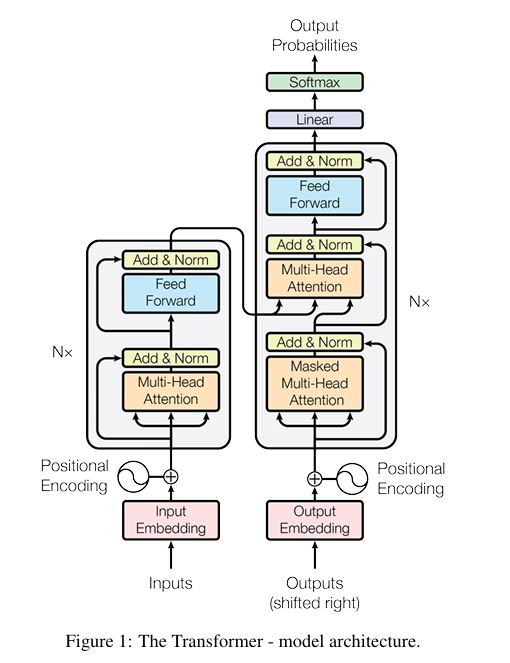
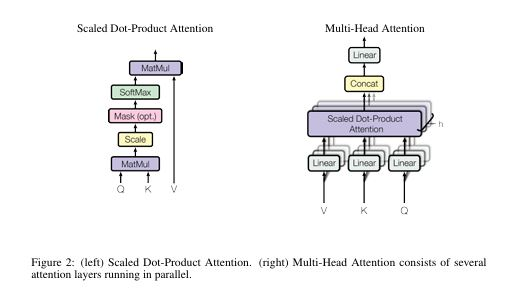
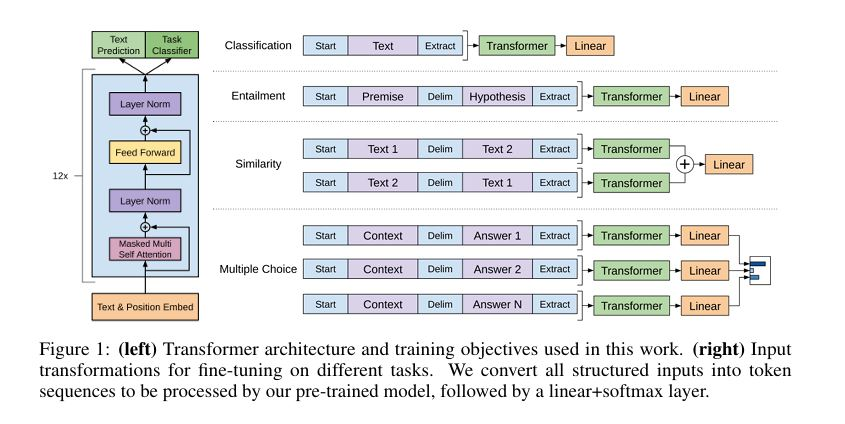
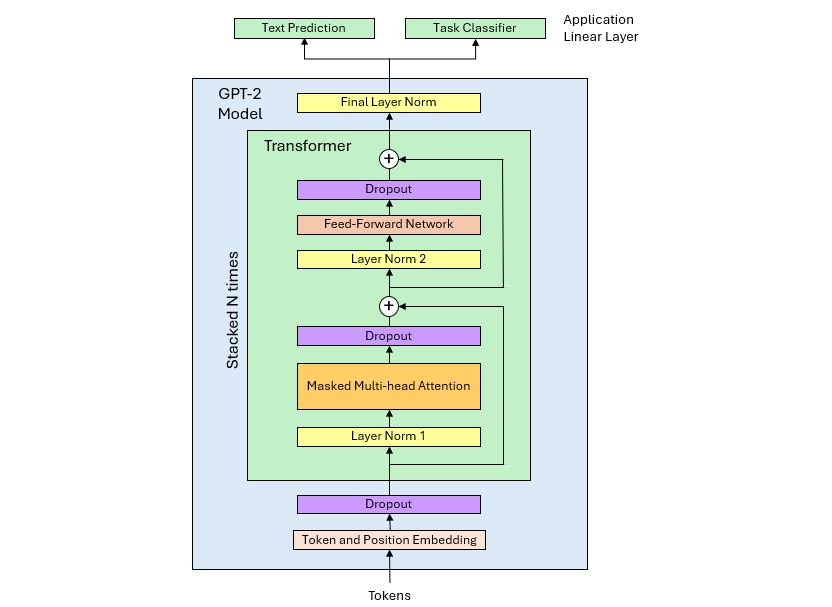

# GPT-2 Model in TensorFlow

"What I cannot create, I do not understand."
— **Richard Feynman**

## 1. Introduction

This repo contains a TensorFlow implementation of OpenAI's GPT-2 model.

The goal of this project was to construct the model using only these three foundational research papers:

- The original Transformer paper published in 2017:

   Ashish Vaswani, Noam Shazeer, Niki Parmar, Jakob Uszkoreit, Llion Jones, Aidan N. Gomez, Lukasz Kaiser, Illia Polosukhin.
    ["Attention Is All You Need."](https://arxiv.org/abs/1706.03762)


- The GPT paper published by OpenAI in 2018:

    Alec Radford, Karthik Narasimhan, Tim Salimans, Ilya Sutskever.
    ["Improving Language Understanding by Generative Pre-Training"](https://cdn.openai.com/research-covers/language-unsupervised/language_understanding_paper.pdf)

- The GPT-2 paper published by OpenAI in 2019:

    Alec Radford, Jeffrey Wu, Rewon Child, David Luan, Dario Amodei, Ilya Sutskever.
    ["Language Models are Unsupervised Multitask Learners."](https://cdn.openai.com/better-language-models/language_models_are_unsupervised_multitask_learners.pdf?utm_source=chatgpt.com)

My ultimate goal was to be able to load into my model the GPT-2 pretrained weights released by OpenAI, and to verify that it generates sensible text from example prompts.

## 2. Source code and Python packages

The files for this project are in the */src* directory as shown below.

```
   src
    |     
    ├── gpt2_language_model.py     # GPT-2 model with LM head
    |
    ├── model_utils.py             # Create a model, print model variables, count parameters
    |
    ├── compare_vars.py            # Compare trainable variables to Hugging Face models
    |
    ├── model_vars.txt             # Model variables versus Hugging Face variables
	|
	└── test_prompt.py             # Create a model and generate a text from a prompt

```

The Python packages I used are listed in file *requirements.txt*. TensorFlow 2.14.1 or older is required to run the code.

To see the model in action, run script *test_prompt.py* that instantiates a GPT-2 model and generates text from a prompt. You can choose a model size and try your own prompts, and also play with the next-token selection parameters to generate more conservative or "creative" texts.

## 3. Methodology

In the section entitled "Model Specifications" of the GPT paper, the authors state:

```
    Our model largely follows the original transformer work. We trained a 12-layer decoder-only
    transformer with masked self-attention heads (768 dimensional states and 12 attention heads).
```

And in section "2.3 Model" of the GPT-2 paper:
```
    We use a Transformer (Vaswani et al., 2017) based architecture for our LMs. The model largely
    follows the details of the OpenAI GPT model (Radford et al., 2018) with a few modifications.
```

Therefore, my implementation prioritized information based on the following hierarchy to ensure alignment with the latest architecture:

1. GPT-2 paper (highest priority)
2. GPT paper
3. Transformer paper


## 4. GPT-2 decoder-only architecture

The original Transformer paper includes the following diagram of the model architecture:



The model comprises an encoder and a decoder that are built with stacks of modules referred to as *layers*.

As shown in the figure, a layer contains multi-head attention blocks, a feed-forward network and layer normalizations.

Diagrams of the attention head and multi-head attention block are also provided in the paper:




The GPT paper contains the following diagram of the GPT model architecture and applications:




In the original transformer-decoder architecture, the layer is built with 3 sub-layers:
- Masked multi-head attention, layer norm
- Encoder-decoder cross-attention, layer norm
- Feed-forward network, layer norm

Because it is a decoder-only architecture, the GPT model requires only 2 sub-layers:
- Masked multi-head attention, layer norm
- Feed-forward network, layer norm.


## 5. GPT-2 model layers and architecture diagram

### Embeddings

In the "Model Specifications" paragraph in section "4.1 Setup" of the GPT paper:

```
    We used learned position embeddings instead of the sinusoidal version proposed 
    in the original work.
```

The GPT-2 paper makes no mention of the type of embeddings they used to capture sequence information, so I assumed that it also uses position embeddings.

The vocabulary size and context length are given in section "2.3 Model" of the GPT-2 paper:

```
    The vocabulary is expanded to 50,257. We also increase the context size
    from 512 to 1024 tokens and a larger batch size of 512 is used.
```

### Layer normalization

In section "2.3 Model" of the GPT-2 paper:

```
    Layer normalization (Ba et al., 2016) was moved to the input of each sub-block, similar to 
    a pre-activation residual network (He et al., 2016) and an additional layer normalization 
    was added after the final self-attention block.
```

Layer normalization to the input of each sub-block is useful to stabilize training, as described in the paper by He et al. that is cited.


### Dropout layers

In Section "5.4 Regularization" of the Transformer paper:

```
    We apply dropout to the output of each sub-layer, before it is added to the sub-layer 
    input and normalized. In addition, we apply dropout to the sums of the embeddings and 
    the positional encodings in both the encoder and decoder stacks. For the base model,
    we use a rate of P_drop=0.1.
```

As neither the GPT nor GPT-2 papers mention dropout, I followed the same configuration as the original Transformer (same layer positions).

### GPT-2 architecture diagram

Using the information above, it is now possible to complete the diagram from the GPT paper and draw the architecture of the GPT-2 model.




## 6. GPT-2 model sizes

Table 1 in the GPT-2 paper shows four sizes for GPT-2 models:

| Parameters | n_layers |  d_model  |
|------------|----------|-----------|
| 117M       |   12     |      768  |
| 345M       |   24     |     1024  |
| 762M       |   36     |     1280  |
| 1542M      |   48     |     1600  |

In this table, *n_layers* is the number of transformer blocks and *d_model* is the model hidden size (size of the embeddings).

The table does not provide the size of the head output and the number of heads in parallel in the multi-head attention block. However, in section "3.2.2 Multi-Head Attention" of the Transformer paper, the authors specify:

```
   We employ h=8 parallel attention layers, or heads. For all models, we use d_model=512 and 
    d_k = d_v = d_model/h = 64
```

d_k = d_v is the size of the Key and Value matrices (although not mentioned, d_q is the same size).

Thus, the Transformer paper states that the head output size *d_head* is equal to 64, and that *d_head* and *d_model* are linked by the following relationship:

```
    n_heads = d_model / 64
```

The GPT and GPT-2 papers don't mention any change in the value of *d_head* or the relationship between *d_head* and *d_model*, so I assumed that they are the same across all GPT-2 model sizes.

We can now add the number of heads *n_heads* to the table.

| Parameters | Layers |  d_model  |  d_head  | n_heads  |
|------------|--------|-----------|----------|----------|
| 117M       |   12   |      768  |    64    |    12    |
| 345M       |   24   |     1024  |    64    |    16    |
| 762M       |   36   |     1280  |    64    |    20    |
| 1542M      |   48   |     1600  |    64    |    25    |


## 7. Feed-forward network

In section "3.3 Position-wise Feed-Forward Networks" of the Transformer paper:

```
    In addition to attention sub-layers, each of the layers in our encoder and decoder contains 
    a fully connected feed-forward network, which is applied to each position separately and
    identically. This consists of two linear transformations with a ReLU activation in between.
```

Further in the same section:

```
    The dimensionality of input and output is d_model = 512, and the inner-layer 
    has dimensionality dff = 2048.
```

Thus, the feed-forward network of the original transformer has 2 layers, and the size of the inner layer is 4x the size of the output layer.

In section "Model specifications" of the GPT paper:

```
    We trained a 12-layer decoder-only transformer with masked self-attention heads 
    (768 dimensional states and 12 attention heads). For the position-wise feed-forward 
    networks, we used 3072 dimensional inner states.
```

As in the original transformer, the inner layer's size is 4x the size of the output layer. As there is no mention of it in the GPT-2 paper, I assumed that this 4x ratio is valid for all the GPT-2 model sizes.

Also mentioned in the same section of the GPT paper:

```
    For the activation function, we used the Gaussian Error Linear Unit (GELU).
```

The GELU yields smoother gradients than the ReLU used in the Transformer model. As it was not mentioned in the GPT-2 paper, I assumed that the GELU activation function was also used in the GPT-2 model.


## 8. Output linear layer

The Transformer paper describes the model output linear layer in section "3.4: Embeddings and Softmax":

```
    Similarly to other sequence transduction models, we use learned embeddings 
    to convert the input tokens and output tokens to vectors of dimension d_model.
    We also use the usual learned linear transformation and softmax function 
    to convert the decoder output to predicted next-token probabilities. In our model,
    we share the same weight matrix between the two embedding layers and the pre-softmax 
    linear transformation, similar to [30].
```

The GPT paper describes the same linear layer in section "3.2 Supervised fine-tuning". The GPT-2 paper makes no mention of it, so I assumed that it is the same as in the Transformer and GPT papers.

The output linear layer projects the final decoder representations to the vocabulary size, followed by a softmax function to produce next-token probabilities. The weights of the projection matrix Wy are shared with the embedding matrix E, as mentioned in the paper. The input embedding layer maps tokens to embeddings while the output linear transformation maps embeddings back to tokens, so Wy is the transpose of E.

The weights shared between E and Wy are the token embedding weights. Positional embeddings are not part of the token-to-vocabulary mapping, so they are not shared with the output projection.

## 9. Model implementation

Using the research papers and the findings above, implementing the model in TensorFlow was straightforward.

 I concatenated the Wq, Wk and Wv matrices in a single matrix to make the computation of Q, K and V more efficient (only one matrix product), as described in section "3.2.1 Scaled Dot-Product Attention" of the Transformer paper:

```
    In practice, we compute the attention function on a set of queries simultaneously,
    packed together into a matrix Q. The keys and values are also packed together 
    into matrices K and V.
```

Although it was not mentioned in the paper, I implemented an *attention mask* to avoid that the model attends to padding tokens in the input sequence. Because the model takes tensors of fixed dimensions as inputs, padding tokens are required when running through the model a batch of input sequences that have different lengths. Implementation was straightforward using the same mechanism as for causal inference.


## 10. Model parameter counts

Function *print_trainable_variables()* in *model_utils.py* prints the trainable variables of a model, showing their shapes and number of parameters.

Running this function for all the model sizes in the GPT-2 paper gave the results shown in the table below.

| GPT-2 paper   | My model                  |
|---------------|---------------------------|
| 117M          |   124,439,808 ~ 124M      |
| 345M          |   354,823,168 ~ 355M      |
| 762M          |   774,030,080 ~ 774M      |
| 1542M         |  1,557,611,200 ~ 1558M    |

My model sizes are different from the numbers given in the GPT-2 paper. I had to do some research as I could not find any explanation. It turns out that my numbers are accurate and the community standardized on them after the publication of the GPT-2 paper. To avoid any confusion, I did the same and used the names 124M, 355M, 774M and 1558M in my code.

## 11. Loading OpenAI's pretrained weights

OpenAI's weights for GPT-2 models can be obtained from multiple sources. I used the *transformers* package developed by Hugging Face.

Keras stores the list of trainable variables of a model in its *trainable_variables* attribute. Transferring the weights from a source model to a target model is trivial if their lists of trainable variables match one-to-one, which requires the two models to share the same organization in layers and sub-layers.

File *model_vars.txt* contains a one-to-one comparison of the trainable variables of my 124M model and the corresponding Hugging Face model, which is called "gpt2". Although they have different names, all the variables align. Hugging Face obviously followed the model architecture specified in the research papers, just like I did.

Therefore, a simple loop through trainable variables was enough to transfer the Hugging Face weights to my model.

## 12. Generating responses to prompts

I implemented four methods to select the next token when generating text from a prompt: greedy, temperature scaling, top-k sampling, and top-p (nucleus) sampling.

The script *test_prompt.py* creates a model and gets its response to a prompt. You can try your own prompts, and play with the next-token sampling parameters to get more conservative or "creative" answers. Use the --help option of the script for usage details.

Below are examples of responses from a 774M model to the prompt "The secret to living a happy life is ". The first one shows the gibberish the model generated when used without loading OpenAI's pretrained weights. Those that follow were obtained with different sampling parameter settings.

__No pretrained weights__


The secret to living a happy life isBeer覚醒18 reson modemofi demonstrated disag 46 Gamb  domain spoon reappCentral435presentsforth nodes Additionallynsizzlenuclearreading?!" simplifiedEPSDynamic filmmakers Mist Brune king CBO extension PricingBytes DNua simplifiedjection backersacistsalternateMTreeesthesiatariansdifferent invalid flagship farmer


__greedy__


The secret to living a happy life is to be happy with yourself.  If you are unhappy with yourself, you will be unhappy with everyone around you.  If you are unhappy with everyone around you, you will be unhappy with yourself.  If you are unhappy with  yourself, you will be unhappy with everyone around you.  If you are unhappy with yourself,  you will be unhappy with everyone around you.  If you are unhappy with yourself, you will be unhappy with everyone around you.

__temperature=0.8, top_k=20__


The secret to living a happy life is to be aware of the things that are important to you. You can start by asking the questions below:

What are the things that I value the most in life?

What are the things that I do not value?


What is the difference between being happy and being healthy?

How can I live a happy life?

Is there an easy way to be happy?

I don't know where to start?

I want to be happy and


__temperature=0.8, top_k=30__


The secret to living a happy life is ____________," and then another one that's not so secret, "I'm just not that good at ________." And then there's this one, "I'm better than you. I'm better than you. I'm better than you." All of this is just a huge waste of time.

Advertisement

Your browser does not support HTML5 video tag.Click here to view original GIF

I'm going to say it now: I am better than you. And that


__temperature=0.8, top_p=0.9__


The secret to living a happy life is not making it work.  If you make it work, then you're not really living a happy life.  There's a lot of value in that. I've even heard it said that happiness is  a virtue of solitude.  In other words, it's not the happiness that you have in a group, but the happiness you have in solitude.  Because of that, it's important to be truly alone.  I mean, you can never


__temperature=0.8  top_p=0.9__


The secret to living a happy life is  to be honest with yourself and to accept what you can't control. You will never live your life perfect if you are afraid of change. If you are afraid of change, you will never live your life full of joy. If you are afraid of change, you will never live your life full of love.The internet has the power to change the world, and one of the most powerful minds on the planet is working on ways to bring it to fruition.

Tech billionaire Yuri Mil


__temperature=1.2__


The secret to living a happy life is  having often repeatedly smaller scenes. If we are constantly coming up next to someone who runs or rides prematurely, with our intellect fading or being focused and angles twisting, losing inwardly is just pointlessly constraint on the ability to experience. Stage 1 usually reproduces the sense... Ergo. End into Stage 2 crystallizes the idea. Now comes researches really about how insights travel, both relative forward and backward, allowing insight freely hom  updating Monday to Friday hope not people would tell an excuse the tr


## 13. Conclusion

The Transformer, GPT and GPT-2 papers proved sufficient to recreate the original GPT-2 model. No important detail was missing.

The only significant issue I encountered was that the number of parameters I obtained for each model size did not match the numbers from the GPT-2 paper. As it turns out, my numbers are accurate and have largely become the community standard.

Ultimately, I was able to load OpenAI's pretrained weights into my model and generate sensible text with it. The proof is in the pudding!

In my next project, I fine-tuned the model to perform multiple tasks: answering questions, simplifying texts, and classifying news. I made various enhancements to the model, in particular the addition of LoRA adapters to the attention heads. I first experimented with sequential training of the same model on several datasets, demonstrating examples of catastrophic forgetting. Then, I trained three LoRA adapters, each on a different task, and obtained some impressive results.

See GitHub repo [model_tuning_with_lora](https://github.com/GuyDupenloup/model_tuning_with_lora?tab=readme-ov-file).
