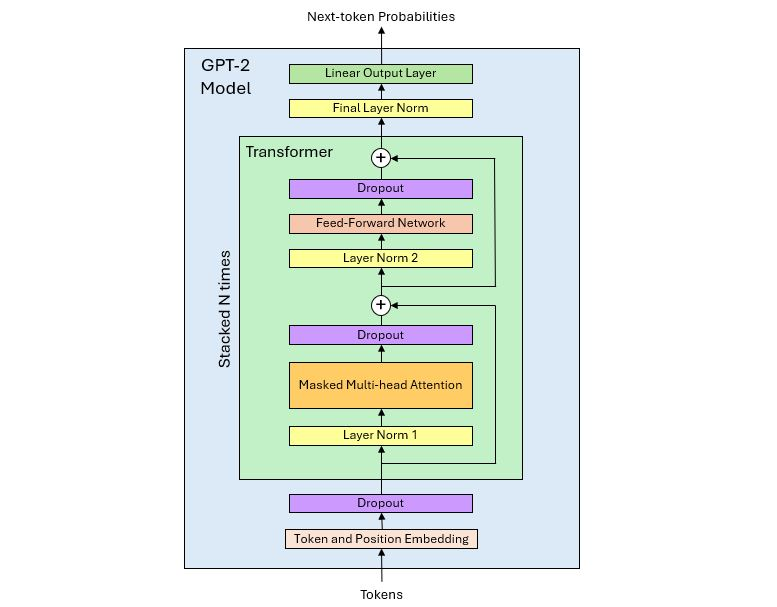

# GPT-2 Model in Tensorflow

## 1. Introduction

This repo contains a Tensorflow implementation of OpenAI's GPT-2 model.

The main goal of this project was to construct the model using only these three research papers:

- The original transformer paper published in 2017:

   Ashish Vaswani, Noam Shazeer, Niki Parmar, Jakob Uszkoreit, Llion Jones, Aidan N. Gomez, Lukasz Kaiser, Illia Polosukhin.
    ["Attention Is All You Need."](https://arxiv.org/abs/1706.03762)

- The GPT paper published by OpenAI in 2018:

    Alec Radford, Karthik Narasimhan, Tim Salimans, Ilya Sutskever.
    ["Improving Language Understanding by Generative Pre-Training"](https://cdn.openai.com/research-covers/language-unsupervised/language_understanding_paper.pdf)

- The GPT-2 paper published by OpenAI in 2019:

    Alec Radford, Jeffrey Wu, Rewon Child, David Luan, Dario Amodei, Ilya Sutskever.
    ["Language Models are Unsupervised Multitask Learners."](https://cdn.openai.com/better-language-models/language_models_are_unsupervised_multitask_learners.pdf?utm_source=chatgpt.com)

### 2. Methodology

In the section entitled 'Model Specifications' of the GPT paper, the authors state:

    "Our model largely follows the original transformer work. We trained a 12-layer decoder-only
    transformer with masked self-attention heads (768 dimensional states and 12 attention heads).

And in section '2.3 Model' of the GPT-2 paper:

    "We use a Transformer (Vaswani et al., 2017) based architecture for our LMs. The model largely
    follows the details of the OpenAI GPT model (Radford et al., 2018) with a few modifications."

Therefore, my implementation prioritized information based on the following hierarchy:

1. GPT-2 paper (highest priority)
2. GPT paper
3. Transformer paper

## 3. Source code

The files for this project are in the **/src** directory and are listed in the table below.

| Filename                |  Contents                                                                |
|-------------------------|--------------------------------------------------------------------------|
| gpt2_model.py           |  GPT-2 model                                                             |
| gpt2_model_aligned.py   |  GPT-2 model aligned with Hugging Face model                             |
| utils.py                |  Utilities and shared functions                                          |
| model_summary.txt       |  Summary of the smallest GPT-2 model (layer shapes and parameters)       |
| train_vars.txt          |  Comparison of trainable variables in my model and Hugging Face's model  |
| generate_text.py        |  Script to generate text with the model                                  |

## 4. GPT-2 decoder-only architecture

The original Transformer paper includes the following diagram of the model architecture:

The model comprises an encoder and a decoder that are built with stacks of multi-head attention blocks.

Diagrams of the attention head and multi-head attention block are also provided in the same paper:

The GPT paper contains the following diagram of the GPT model architecture:

In the original transformer-decoder architecture, the layer is built with 3 sub-layers:
- Masked multi-head attention, layer norm
- Encoder-decoder cross-attention, layer norm
- Feed-forward network, layer norm

Because it is a decoder-only architecture, the GPT model requires only 2 sub-layers:
- Masked multi-head attention, layer norm
- Feed-forward network, layer norm.

In the original Transformer paper, the term 'layer' refers to a transformer block (a unit containing attention and feed-forward sub-layers). The model 'hidden size' refers to the size of the embeddings. I used the same terminology.

## 5. GPT-2 model layers and architecture diagram

### Embeddings

In the 'Model Specifications' section of the GPT paper:

    "We used learned position embeddings instead of the sinusoidal version proposed in the original work."

The GPT-2 paper makes no mention of embeddings, so I assumed that it also uses position embeddings.

The vocabulary size and context length are given in section '2.3 Model' of the GPT-2 paper:

    "The vocabulary is expanded to 50,257. We also increase the context size from 512 
    to 1024 tokens and a larger batch size of 512 is used."

### Layer normalization

In section '2.3 Model' of the GPT-2 paper:

    "Layer normalization (Ba et al., 2016) was moved to the input of each sub-block, similar to 
    a pre-activation residual network (He et al., 2016) and an additional layer normalization 
    was added after the final self-attention block."

### Dropout layers

In Section '5.4 Regularization' of the Transformer paper:

    "We apply dropout to the output of each sub-layer, before it is added to the sub-layer 
    input and normalized. In addition, we apply dropout to the sums of the embeddings and 
    the positional encodings in both the encoder and decoder stacks. For the base model,
    we use a rate of P_drop=0.1."

As neither the GPT nor GPT-2 papers mention dropout, I followed the same configuration as the original Transformer (same layer positions, P_drop=0.1).

### GPT-2 architecture diagram

Using the information above, it is now possible to complete the diagram of the GPT architecture and draw the architecture of the GPT-2 model.

## 6. GPT-2 model sizes

Table 1 in the GPT-2 paper shows four sizes for GPT-2 models:

| Parameters | n_layers |  d_model  |
|------------|----------|-----------|
| 117M       |   12     |      768  |
| 345M       |   24     |     1024  |
| 762M       |   36     |     1280  |
| 1542M      |   48     |     1600  |

In this table, *n_layers* is the number of transformer blocks and *d_model* is the model hidden size (size of the embeddings).

The table does not provide the size of the head output and the number of heads in parallel in the multi-head attention block. However, in section '3.2.2 Multi-Head Attention' of the Transformer paper, the authors specify:

    “We employ h=8 parallel attention layers, or heads. For all models, we use d_model=512 and 
    d_k = d_v = d_model/h = 64"

d_k = d_v is the size of the Key and Value matrices (although not mentioned, d_q is the same size).

Thus, the Transformer paper states that the head output size *d_head* is equal to 64, and that *d_head* and *d_model* are linked by the following relationship:

        n_heads = d_model / 64

The GPT and GPT-2 papers don't mention any change in the value of *d_head* or the relationship between *d_head* and *d_model*, so I assumed that they are the same across all GPT-2 model sizes.

We can now add the number of heads *n_heads* to the table.

| Parameters | Layers |  d_model  |  d_head  | n_heads  |
|------------|--------|-----------|----------|----------|
| 117M       |   12   |      768  |    64    |    12    |
| 345M       |   24   |     1024  |    64    |    16    |
| 762M       |   36   |     1280  |    64    |    20    |
| 1542M      |   48   |     1600  |    64    |    25    |

## 7. Feed-forward network

In section '3.3 Position-wise Feed-Forward Networks' of the Transformer paper:

    "In addition to attention sub-layers, each of the layers in our encoder and decoder contains 
    a fully connected feed-forward network, which is applied to each position separately and
    identically. This consists of two linear transformations with a ReLU activation in between."

Further in the same section:

    "The dimensionality of input and output is d_model = 512, and the inner-layer 
    has dimensionality dff = 2048."

The feed-forward network of the original transformer has 2 layers, and the size of the inner layer is 4x the size of the output layer.

In section 'Model specifications' of the GPT paper:

    "We trained a 12-layer decoder-only transformer with masked self-attention heads 
    (768 dimensional states and 12 attention heads). For the position-wise feed-forward 
    networks, we used 3072 dimensional inner states."

As in the original transformer, the inner layer's size is 4x the size of the output layer. As there is no mention of it in the GPT-2 paper, I assumed that this 4x ratio is valid for all the GPT-2 model sizes.

Also mentioned in the same section of the GPT paper:

    "For the activation function, we used the Gaussian Error Linear Unit (GELU)."

As it was not mentioned in the GPT-2 paper, I assumed that the GELU activation function was also used in the GPT-2 model.

### 8. Output linear layer

The Transformer paper describes the model output linear layer in section '3.4: Embeddings and Softmax':

    "Similarly to other sequence transduction models, we use learned embeddings 
    to convert the input tokens and output tokens to vectors of dimension d_model.
    We also use the usual learned linear transformation and softmax function 
    to convert the decoder output to predicted next-token probabilities. In our model,
    we share the same weight matrix between the two embedding layers and the pre-softmax 
    linear transformation, similar to [30]. In the embedding layers, we multiply those 
    weights by sqrt(d_model)."

The GPT paper describes the same linear layer in section '3.2 Supervised fine-tuning'. The GPT-2 paper does not mention it, so I assumed that it is the same as in the Transformer and GPT papers.

The output linear layer projects the final decoder representations to the vocabulary size, followed by a softmax function to produce next-token probabilities. The weights of the projection matrix Wy are shared with the embedding matrix E. The input embedding layer maps tokens to embeddings while the output linear transformation maps embeddings back to tokens, so Wy is the transpose of E.

Although not mentioned in any of the three papers, the weights shared between E and Wy are the token embedding weights. Positional embeddings are not part of the token-to-vocabulary mapping, so they are not shared with the output projection.

## 9. Model implementation

Using the research papers and the findings above, implementing the model in Tensorflow was straightforward.

The model is in file **src/gpt2_model.py**.

I followed the implementation of the Wq, Wk and Wv matrices described in section '3.2.1 Scaled Dot-Product Attention' of the Transformer paper:

    "In practice, we compute the attention function on a set of queries simultaneously, packed together
    into a matrix Q. The keys and values are also packed together into matrices K and V."

Like in the Transformer paper, I concatenated the Wq, Wk and Wv matrices in a single matrix rather than using 3 distinct matrices. This makes the computation of Q, K and V more efficient (only one matrix product).

## 10. Model parameter counts

I used the **all_model_sizes_summary()** function in file **utils.py** to count the number of trainable parameters for each model size. The output of the function for the smallest model size is in file **model_summary.txt**.

Running the script for all the model sizes in the GPT-2 paper gave the following results.

| GPT-2 paper   | My model    |
|---------------|-------------|
| 117M          |   124M      |
| 345M          |   355M      |
| 762M          |   774M      |
| 1542M         |  1542M      |

The first two model sizes are different from the numbers given in the GPT-2 paper.

Here I had to do some research as I could not find any explanation for these differences. I found out from different sources that OpenAI's numbers actually are inaccurate. Mine are correct.

## 11. Loading OpenAI's pretrained weights

OpenAI's weights for GPT-2 models can be obtained from multiple sources. I used the **transformers** package developed by Hugging Face.

Keras stores the list of trainable variables of a model in its **trainable_variables** attribute. The simplest approach to transfer the weights from a source model to a target model is to ensure that the elements of their lists of variables match one-to-one. Then, a simple loop through the variable lists is sufficient to read the weights from the source model and write them to the target model.

There are two conditions to make this possible:
1. Both models must share the same decomposition in layers and sub-layers.
2. Layers must be declared in the same order in both **__init()__** methods.

The variables of my model matched those of the Hugging Face model right away, with no change required to my model. I strictly followed the model architecture described in the research papers, and Hugging Face clearly did the same.

I used the **compare_train_vars()** function in file **utils.py** to print and compare the trainable variables of both models. The output of the function for the smallest model size is in file **train_vars.txt**. It shows that the variables match one-to-one (although they have different names).

There is one difference, though. Bias variables in the Hugging Face model have shape (1, N) while in my model they have shape (N,), which is the shape Keras gives them. Biases have to be broadcasted, and using the (1, N) shape has the advantage of making the broadcasting axis explicit. However, it is more complex as it requires custom layers.

For the sake of simplicity, given that Keras automatically handles broadcasting, I stuck with the standard layers. When transferring the weights, I just had to reshape the bias layers in the Hugging Face model from (1, N) to (N,).

## 12. Aligning with OpenAI's model

After completing my model, I verified its alignment with OpenAI’s implementation and the Hugging Face reference model.

I found three differences:

1. **Token embeddings scaling**: In OpenAI's GPT-2 model, the token embeddings are not scaled by sqrt(d_model) like in the original transformer. This was not mentioned anywhere in the GPT or GPT-2 paper.

2. **Model output**: I used a softmax to output next-token probabilities as described in the Transformer paper. The Hugging Face model outputs logits.

3. **Attention mask**: The Hugging Face model includes an optional attention mask that can be used to avoid that the model attends to padding tokens. It is unclear if the original transformer, GPT or GPT-2 models had it.

To align my model with the Huggin Face model, I removed the token embeddings scaling and the softmax. I also added an optional attention mask. The updated model is in file **gpt2_model_aligned.py**.

## 13. Generating text with the final model

File **generate_text.py** contains functions to generate text, one token at a time.

Greedy selection of the next token, temperature and top-k are supported.

Refer to the comments in the file for explanations on how to use it.
